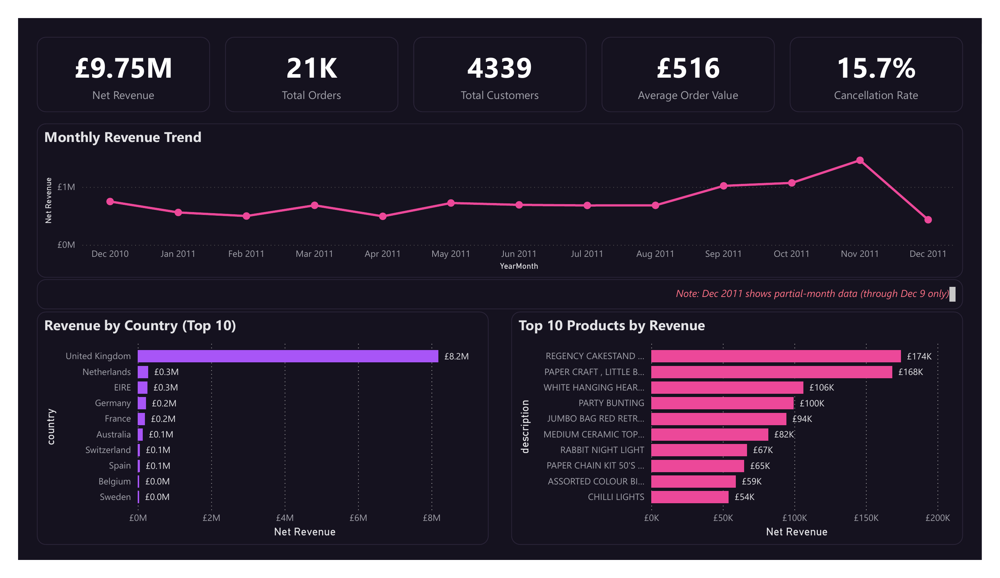
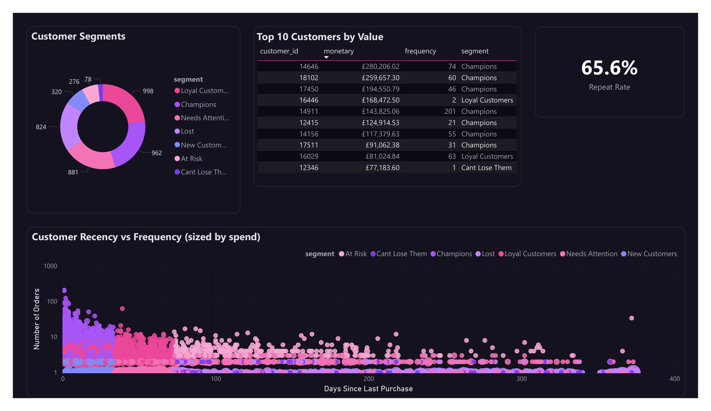
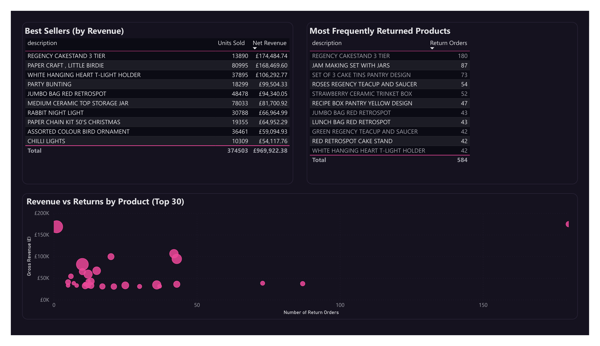
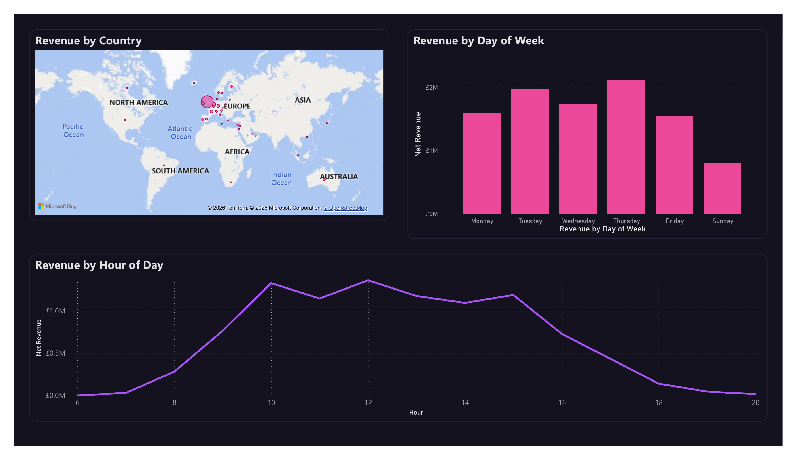
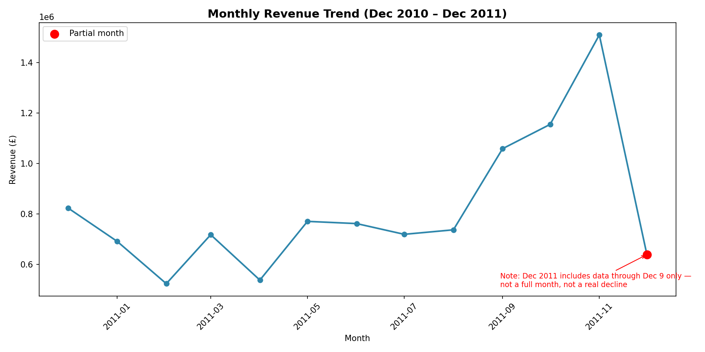
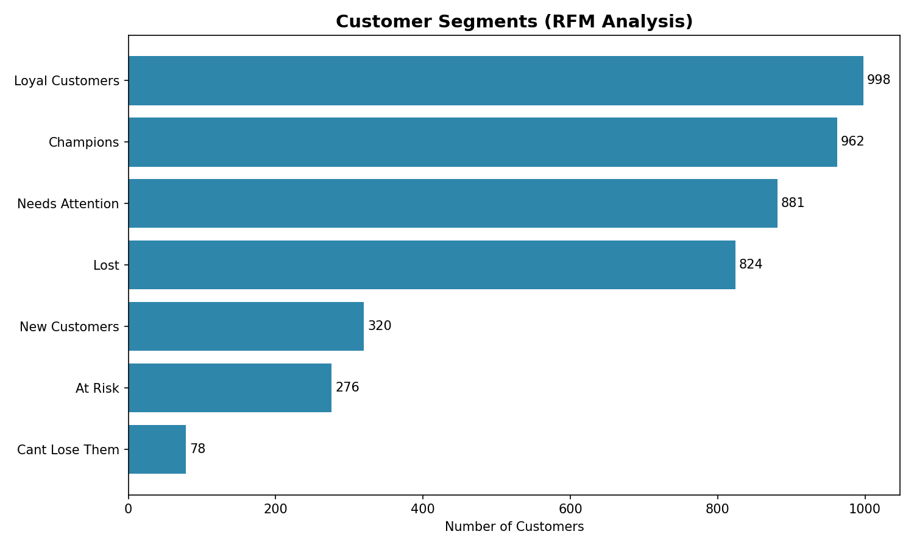
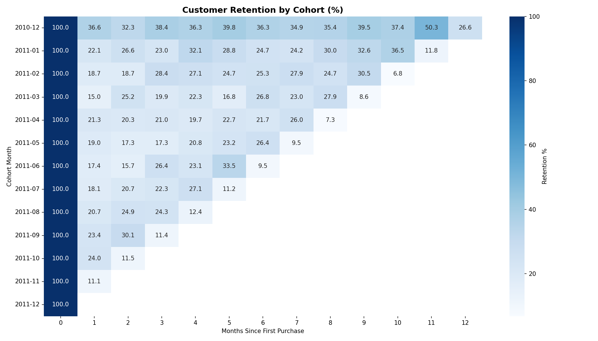

# Online Retail Analysis: Customer Behavior, Product Performance & Revenue Strategy

An end-to-end analysis of 12 months of transaction data for a UK-based online gift retailer — approached as a Business Data Analyst engagement: understand the business, clean and validate the data, uncover what's actually driving revenue and customer behavior, and turn that into decisions leadership can act on.

## Business Problem

The company wanted to know: where is revenue coming from, which customers matter most, and what should change to grow the business. This analysis works through that from raw transaction data to a four-page interactive dashboard and a set of concrete recommendations — not just "what happened," but "what to do about it."

## Dataset Overview

Source: [UCI Online Retail Dataset](https://archive.ics.uci.edu/dataset/352/online+retail)

| | |
|---|---|
| Raw transactions | 541,909 |
| Time period | Dec 1, 2010 – Dec 9, 2011 |
| Countries | 38 (91% of transactions from the UK) |
| Customers | 4,339 (after cleaning) |

| Column | Description |
|---|---|
| InvoiceNo | Transaction ID. Prefix "C" indicates a cancellation/return |
| StockCode | Product code |
| Description | Product name |
| Quantity | Units purchased (negative = return) |
| InvoiceDate | Date and time of transaction |
| UnitPrice | Price per unit (GBP) |
| CustomerID | Unique customer identifier (~25% missing — guest/unregistered orders) |
| Country | Ship-to country |

Order volumes (one single order of 80,995 units) and commission line items (`AMAZONFEE`, `CRUK Commission`) suggest a mixed B2C/wholesale customer base rather than a purely consumer storefront.

## Tech Stack

- **SQL** — PostgreSQL 18.1, for data profiling and cleaning
- **Python** — pandas, SQLAlchemy, matplotlib, seaborn (Jupyter Notebook) for EDA, RFM segmentation, cohort analysis, and CLV
- **Power BI Desktop** — 4-page interactive dashboard with custom DAX measures and a custom dark theme
- **PostgreSQL** — served as the shared backend, with cleaned tables and RFM results feeding directly into Power BI

## Repository Structure

```
online-retail-analysis/
│
├── data/                     Raw and processed data
├── notebooks/                 Python EDA, RFM, cohort, and CLV analysis
├── sql/                       Data profiling and cleaning scripts
├── powerbi/                   Power BI dashboard file (.pbix)
├── images/                    Charts and dashboard screenshots
├── README.md                  This file
└── insights.md                Full business recommendations
```

## Methodology

**1. Data cleaning (SQL)** — Every anomaly was investigated before any decision was made to keep, flag, or exclude it:
- **"Duplicate" rows (5,268):** confirmed as legitimate split single-unit sales (e.g., one invoice logging the same product across 76 separate lines), not data errors — kept as-is.
- **Cancellations (9,288 rows, -£896,812):** kept and flagged with `is_cancellation`, enabling both gross and net revenue views.
- **Non-merchandise line items** (`POST`, `DOT`, `D`, `M`, `S`, `AMAZONFEE`, `CRUK`, `B`): flagged with `is_merchandise` — kept for completeness, excluded from product-level rankings.
- **1,454 rows** with no description, no price, and no customer ID (100% overlap across all three) carried no usable information and were excluded entirely.

Result: a clean, flagged table (`online_retail_clean`, 540,455 rows) that supports both raw-audit and analysis-ready views without losing any underlying data.

**2. Exploratory analysis (Python)** — Revenue trends, product rankings (cross-validated three ways — revenue, quantity, and order count — to catch wholesale-order distortions), customer behavior, return patterns, and time-of-day/day-of-week purchasing patterns.

**3. Advanced analytics (Python)** — RFM segmentation (7 customer segments), cohort retention analysis, and historical customer lifetime value.

**4. Dashboard (Power BI)** — Four pages translating the analysis into an interactive tool: Executive Dashboard, Customer Insights, Product Performance, and Geographic & Time Analysis.

**5. Recommendations** — See [insights.md](insights.md) for the full write-up.

## Key Findings

- **Net revenue of £9.75M**, with **£896,812** lost to cancellations — a real, quantifiable cost of returns.
- **84.6% of revenue comes from the UK alone** — the business is heavily concentrated in a single market.
- **The top 10% of customers (433 people) generate 61.3% of revenue**, while overall repeat purchase rate sits at a healthy **65.6%**.
- **REGENCY CAKESTAND 3 TIER** is simultaneously the #1 product by revenue *and* the #1 most-returned product — a likely packaging or fragility issue hiding inside a top performer.
- Raw "units sold" rankings are unreliable on this dataset — a single 80,995-unit wholesale order (cancelled 12 minutes after being placed) would have wrongly crowned a one-off bulk purchase as the "best-selling product." Cross-validating against order count corrected this.
- Cohort analysis confirmed a genuine, recurring **seasonal retention spike each November** — not random variation.

Full reasoning and recommendations for each finding: [insights.md](insights.md)

## Dashboard

**Executive Dashboard** — Revenue, orders, customers, AOV, and cancellation rate at a glance, with monthly trend and top country/product breakdowns.


**Customer Insights** — RFM segmentation, top customers by value, repeat rate, and a recency-vs-frequency view of the customer base.


**Product Performance** — Best sellers, most-returned products, and a revenue-vs-returns view that surfaces problem products at a glance.


**Geographic & Time Analysis** — Revenue by country, day-of-week, and hour-of-day purchasing patterns.


## Supporting Charts

Monthly revenue trend (with partial-month annotation), RFM segment distribution, and cohort retention heatmap, generated in Python during EDA:





## Recommendations

Ten specific, actionable recommendations spanning revenue growth, customer retention, product quality, and operations — each grounded in a specific finding from this analysis. Full write-up: **[insights.md](insights.md)**
